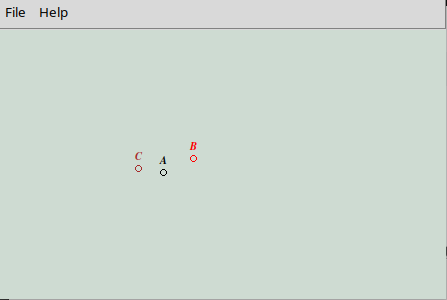

# Run a vehicle

## TestVehicle

Create a `TestVehicle` application by building the code.

Currently not all the code is present for building the libraries and applications that use OpenDDS.

Start a vehicle by running the `TestVehicle.bash`  script

## Run 3 vehicles

Start the DCPS Info repository (Discovery system):

> `DCPSInfoRepo.bash`  (in scripts)

You will get a similar output as the following:

```log
   Server:127.0.0.1
   Port  :12345
   TAO (141227|141227) - Completed initializing the process-wide service context
   TAO (141227|141227) - Default ORB services initialization begins
   TAO (141227|141227) - ORBInitializer_Registry::register_orb_initializer 0 @0x5b5bd2074b30
   TAO (141227|141227) - ORBInitializer_Registry::register_orb_initializer 1 @0x5b5bd206cd60
   TAO (141227|141227) - Default ORB services initialization completed
   TAO (141227|141227) - We are the default 2.5.21 ORB ...
   TAO (141227|141227) - Initializing the orb-specific services
```

Now run three vehicles by issuing the following commands in a separate terminal:

> `./TestVehicle.bash --name=A`
> `./TestVehicle.bash --name=B`
> `./TestVehicle.bash --name=C`

Output of vehicle A: receiving data from vehicle B and C

```log
READER RECEIVED From: C index[542]; Speed: 22.1865
READER RECEIVED From: B index[565]; Speed: 23.0249
READER RECEIVED From: C index[543]; Speed: 22.4973
READER RECEIVED From: B index[566]; Speed: 23.51
READER RECEIVED From: C index[544]; Speed: 21.8451
READER RECEIVED From: B index[567]; Speed: 23.9636
READER RECEIVED From: C index[545]; Speed: 22.4003
READER RECEIVED From: B index[568]; Speed: 24.538
READER RECEIVED From: C index[546]; Speed: 22.0584
READER RECEIVED From: B index[569]; Speed: 24.0421
```

- Output of vehicle B: receiving data from vehicle A and C

```log
READER RECEIVED From: C index[565]; Speed: 23.0249
READER RECEIVED From: A index[581]; Speed: 3.83823
READER RECEIVED From: C index[566]; Speed: 23.51
READER RECEIVED From: A index[582]; Speed: 4.4548
READER RECEIVED From: C index[567]; Speed: 23.9636
READER RECEIVED From: A index[583]; Speed: 4.2274
READER RECEIVED From: C index[568]; Speed: 24.538
READER RECEIVED From: A index[584]; Speed: 3.67624
READER RECEIVED From: C index[569]; Speed: 24.0421
READER RECEIVED From: A index[585]; Speed: 4.57389
READER RECEIVED From: C index[570]; Speed: 23.5426
```

- Output of vehicle C: receiving data from vehicle A and B

```log
READER RECEIVED From: B index[565]; Speed: 23.0249
READER RECEIVED From: A index[581]; Speed: 3.83823
READER RECEIVED From: B index[566]; Speed: 23.51
READER RECEIVED From: A index[582]; Speed: 4.4548
READER RECEIVED From: B index[567]; Speed: 23.9636
READER RECEIVED From: A index[583]; Speed: 4.2274
READER RECEIVED From: B index[568]; Speed: 24.538
READER RECEIVED From: A index[584]; Speed: 3.67624
READER RECEIVED From: B index[569]; Speed: 24.0421
READER RECEIVED From: A index[585]; Speed: 4.57389
READER RECEIVED From: B index[570]; Speed: 23.5426
```

## Monitor the vehicles with python

Open a new terminal

Run:

> `python VehicleMonitor.py`



This will show 3 vehicles randomly moving and sending each other their speeds.
